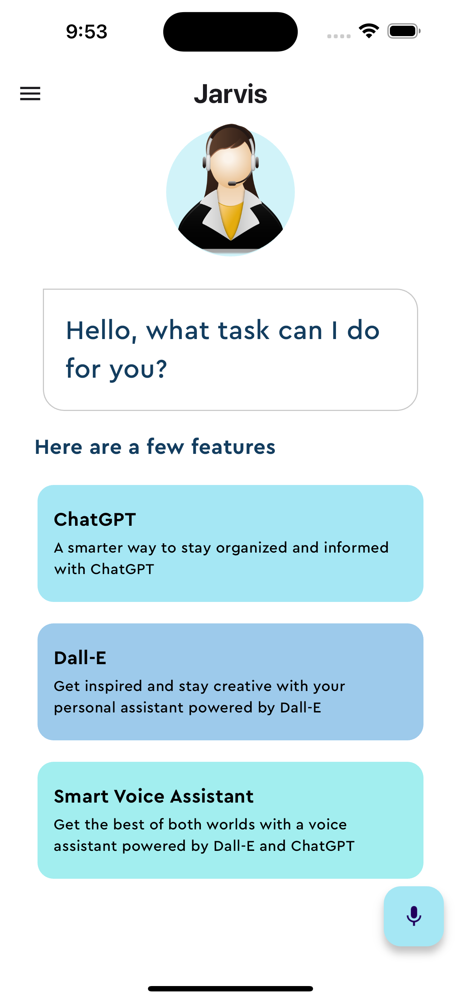

# Jarvis: Voice Assistant App

Jarvis is a voice assistant app built using Flutter and Dart. It integrates with OpenAI to provide intelligent responses to user queries and tasks. The app offers features such as voice recognition, natural language processing, and image generation using state-of-the-art AI models.

## Features

- **Voice recognition:** Users can interact with Jarvis using voice commands.
- **Natural language processing:** Jarvis can understand and respond to natural language queries.
- **AI-generated responses:** Powered by OpenAI's GPT-3.5 Turbo model, Jarvis provides intelligent responses to user queries.
- **Image generation:** Jarvis leverages OpenAI's DALL-E model to generate images based on user prompts.

## Screenshots

<div style="display: flex; justify-content: space-between;">
  
</div>

## Getting Started

To run this project locally, follow these steps:

1. **Clone the repository**:

   ```bash
   git clone https://github.com/aryanbhardwaj24/jarvis.git
   ```

2. **Navigate to Directory**: Change into the project directory:

   ```bash
   cd jarvis
   ```

3. **API Keys Setup**: You need to obtain OpenAIAPIKey from the [OpenAIAPI](https://platform.openai.com/api-keys). Create a new file named `secrets.dart` inside the `lib/` directory. Add your API key to this file as follows:

   ```dart
   // lib/secrets.dart

    const openAIAPIKey = 'YOUR_API_KEY_HERE';
   ```

4. **Install Dependencies**: Install required dependencies using the Flutter package manager:

   ```dart
   flutter pub get
   ```

5. **Run the App**: Launch the app on your local device or simulator:

   ```dart
   flutter run
   ```

## Usage

1. Launch the Jarvis app on your device.

2. Grant necessary permissions for voice recognition if prompted.

3. Tap the microphone button to start voice input.

4. Speak your query or command clearly.

5. Jarvis will process your input and provide a response or perform the requested task.

6. Enjoy interacting with your personal voice assistant!

## License

This project is licensed under the MIT License - see the [LICENSE](LICENSE) file for details.

## Author

[Aryan Bhardwaj](https://github.com/aryanbhardwaj24)
